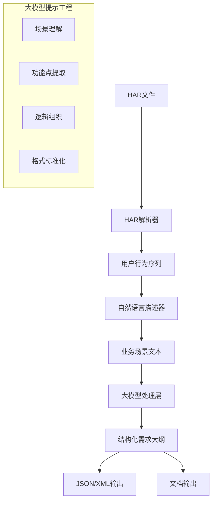

基于你的需求，我将设计一个从HAR文件到结构化需求大纲的完整方案。

## **一、整体架构设计**



## **二、具体实施步骤**

### **步骤1：解析HAR文件，提取业务流程**

```python
import json
from typing import Dict, List, Any
from dataclasses import dataclass
from datetime import datetime
from urllib.parse import urlparse, parse_qs
import re

@dataclass
class UserAction:
    """用户操作记录"""
    timestamp: datetime
    url: str
    method: str
    action_type: str  # click, input, navigate, submit, etc.
    element_info: Dict[str, Any]  # 页面元素信息
    request_data: Dict[str, Any]  # 请求数据
    response_data: Dict[str, Any]  # 响应数据
    wait_time: float  # 等待时间
    success: bool

class HARProcessor:
    """HAR文件处理器"""

    def __init__(self, har_file_path: str):
        with open(har_file_path, 'r', encoding='utf-8') as f:
            self.har_data = json.load(f)
        self.entries = self.har_data.get('log', {}).get('entries', [])

    def extract_user_journey(self) -> List[UserAction]:
        """提取用户旅程"""
        actions = []

        for entry in self.entries:
            try:
                # 解析请求
                request = entry.get('request', {})
                response = entry.get('response', {})
                timings = entry.get('timings', {})

                # 识别用户操作类型
                action_type = self._identify_action_type(request, response)

                # 提取关键信息
                user_action = UserAction(
                    timestamp=datetime.fromisoformat(entry.get('startedDateTime', '').replace('Z', '+00:00')),
                    url=request.get('url', ''),
                    method=request.get('method', ''),
                    action_type=action_type,
                    element_info=self._extract_element_info(request),
                    request_data=self._extract_request_data(request),
                    response_data=self._extract_response_data(response),
                    wait_time=timings.get('wait', 0),
                    success=response.get('status', 0) in [200, 201, 204]
                )

                actions.append(user_action)
            except Exception as e:
                print(f"解析条目失败: {e}")
                continue

        # 按时间排序
        actions.sort(key=lambda x: x.timestamp)
        return actions

    def _identify_action_type(self, request: Dict, response: Dict) -> str:
        """识别操作类型"""
        url = request.get('url', '')
        method = request.get('method', '')
        content_type = response.get('content', {}).get('mimeType', '')

        # 基于URL和方法的启发式识别
        if method == 'GET':
            if '/api/' in url or '.json' in url:
                return 'data_fetch'
            else:
                return 'page_load'
        elif method == 'POST':
            if 'login' in url.lower():
                return 'login'
            elif 'submit' in url.lower() or 'save' in url.lower():
                return 'submit'
            elif 'upload' in url.lower():
                return 'upload'
            else:
                return 'create'
        elif method == 'PUT':
            return 'update'
        elif method == 'DELETE':
            return 'delete'
        else:
            return 'unknown'

    def _extract_request_data(self, request: Dict) -> Dict:
        """提取请求数据"""
        data = {}

        # 提取POST数据
        post_data = request.get('postData', {})
        if post_data:
            if post_data.get('mimeType', '').startswith('application/json'):
                try:
                    data = json.loads(post_data.get('text', '{}'))
                except:
                    pass
            elif post_data.get('mimeType', '').startswith('application/x-www-form-urlencoded'):
                data = {item.get('name'): item.get('value') 
                       for item in post_data.get('params', [])}

        # 提取查询参数
        url = request.get('url', '')
        if '?' in url:
            query_params = parse_qs(url.split('?')[1])
            data.update({k: v[0] if len(v) == 1 else v for k, v in query_params.items()})

        return data

    def _extract_response_data(self, response: Dict) -> Dict:
        """提取响应数据"""
        content = response.get('content', {})
        if content.get('mimeType', '').startswith('application/json'):
            try:
                return json.loads(content.get('text', '{}'))
            except:
                return {}
        return {}

    def _extract_element_info(self, request: Dict) -> Dict:
        """提取页面元素信息（从请求头或referer中推断）"""
        headers = {h['name'].lower(): h['value'] for h in request.get('headers', [])}

        # 从Referer获取来源页面
        referer = headers.get('referer', '')

        # 从User-Agent获取设备信息
        user_agent = headers.get('user-agent', '')

        return {
            'referer': referer,
            'user_agent': user_agent,
            'content_type': headers.get('content-type', ''),
            'accept': headers.get('accept', '')
        }

    def generate_narrative(self, actions: List[UserAction]) -> str:
        """生成自然语言叙述"""
        narrative = "业务流程记录：\n\n"

        for i, action in enumerate(actions, 1):
            narrative += f"步骤{i}: "

            if action.action_type == 'login':
                narrative += f"用户登录系统，使用账号信息进行认证。"
            elif action.action_type == 'page_load':
                narrative += f"用户访问页面: {self._simplify_url(action.url)}"
            elif action.action_type == 'submit':
                narrative += f"用户提交表单，数据: {self._summarize_data(action.request_data)}"
            elif action.action_type == 'data_fetch':
                narrative += f"系统获取数据，接口: {self._get_endpoint(action.url)}"
            elif action.action_type == 'create':
                narrative += f"创建新记录，数据内容: {self._summarize_data(action.request_data)}"
            elif action.action_type == 'update':
                narrative += f"更新记录，更新内容: {self._summarize_data(action.request_data)}"
            elif action.action_type == 'delete':
                narrative += f"删除记录，目标: {self._get_endpoint(action.url)}"
            else:
                narrative += f"执行{action.method}请求到: {self._simplify_url(action.url)}"

            if action.response_data:
                narrative += f"。响应结果: {self._summarize_response(action.response_data)}"

            narrative += f"\n等待时间: {action.wait_time:.2f}ms，状态: {'成功' if action.success else '失败'}\n\n"

        return narrative

    def _simplify_url(self, url: str) -> str:
        """简化URL显示"""
        parsed = urlparse(url)
        return f"{parsed.path}?{parsed.query}" if parsed.query else parsed.path

    def _get_endpoint(self, url: str) -> str:
        """提取API端点"""
        parsed = urlparse(url)
        # 移除查询参数和锚点
        return parsed.path.split('?')[0]

    def _summarize_data(self, data: Dict) -> str:
        """摘要化数据"""
        if not data:
            return "无数据"

        items = []
        for k, v in list(data.items())[:3]:  # 只显示前3个字段
            if isinstance(v, str) and len(v) > 20:
                v = v[:20] + "..."
            items.append(f"{k}: {v}")

        summary = ", ".join(items)
        if len(data) > 3:
            summary += f" 等{len(data)}个字段"

        return summary

    def _summarize_response(self, response: Dict) -> str:
        """摘要化响应"""
        if 'message' in response:
            return response['message']
        elif 'status' in response:
            return f"状态: {response['status']}"
        elif 'data' in response:
            data = response['data']
            if isinstance(data, list):
                return f"返回{len(data)}条记录"
            else:
                return "返回单条记录"
        else:
            return "操作完成"
```

### **步骤2：使用大模型生成结构化需求大纲**

```python
import asyncio
import json
from typing import Dict, List
from dataclasses import dataclass
from enum import Enum

class RequirementType(Enum):
    FUNCTIONAL = "功能性需求"
    NON_FUNCTIONAL = "非功能性需求"
    BUSINESS = "业务需求"
    USER = "用户需求"
    SYSTEM = "系统需求"

@dataclass
class RequirementItem:
    """需求项"""
    id: str
    type: RequirementType
    title: str
    description: str
    priority: str  # High, Medium, Low
    acceptance_criteria: List[str]
    related_actions: List[str]  # 关联的用户操作ID
    dependencies: List[str]  # 依赖的需求ID

class RequirementGenerator:
    """需求大纲生成器"""

    def __init__(self, api_key: str):
        self.api_key = api_key
        self.prompts = self._load_prompts()

    async def generate_requirements(self, narrative: str) -> Dict:
        """生成需求大纲"""
        # 第一步：识别业务场景
        scenario_prompt = self.prompts["identify_scenarios"].format(narrative=narrative[:4000])
        scenarios = await self._call_llm(scenario_prompt)

        # 第二步：提取功能点
        functions_prompt = self.prompts["extract_functions"].format(
            narrative=narrative[:3000],
            scenarios=scenarios
        )
        functions = await self._call_llm(functions_prompt)

        # 第三步：生成结构化需求
        requirements_prompt = self.prompts["generate_requirements"].format(
            narrative=narrative[:2000],
            scenarios=scenarios,
            functions=functions
        )
        structured_requirements = await self._call_llm(requirements_prompt)

        # 第四步：格式化输出
        return self._format_output(structured_requirements)

    def _load_prompts(self) -> Dict[str, str]:
        """加载提示词模板"""
        return {
            "identify_scenarios": """
            你是一个资深的业务分析师。请分析以下用户操作流程，识别出核心业务场景和用户旅程。

            用户操作流程记录：
            {narrative}

            请按以下格式输出：
            1. **主要业务场景**：
               - 场景1名称：[简要描述]
               - 涉及的用户操作步骤：[编号列表]
               - 业务目标：[目标描述]
            2. **次要业务场景**：
               [类似格式]
            3. **异常流程**：
               - 异常1：[描述]
               - 处理方式：[描述]

            请确保识别出至少3个主要业务场景。
            """,

            "extract_functions": """
            基于以下业务场景，提取具体的功能点：

            已识别的业务场景：
            {scenarios}

            原始操作记录：
            {narrative}

            请按以下分类提取功能点：
            A. **核心业务功能**：
               1. [功能名称]
                  - 操作描述：[具体操作]
                  - 输入数据：[数据项]
                  - 输出结果：[结果描述]
                  - 业务规则：[规则说明]
               2. [下一个功能...]

            B. **辅助功能**：
               [类似格式]

            C. **系统管理功能**：
               [类似格式]

            每个功能点请标明优先级（H/M/L）。
            """,

            "generate_requirements": """
            综合以下信息，生成结构化的需求大纲：

            1. 业务场景：
            {scenarios}

            2. 功能点清单：
            {functions}

            3. 原始操作参考：
            {narrative}

            请生成完整的软件需求规格大纲，包括：

            # 1. 项目概述
            - 项目背景
            - 业务目标
            - 项目范围

            # 2. 用户角色与权限
            - 主要用户角色
            - 权限矩阵

            # 3. 业务需求
            ## 3.1 核心业务流程
            [按场景详细描述]

            ## 3.2 业务规则
            [规则列表]

            # 4. 功能需求
            ## 4.1 功能模块1
            - 功能描述
            - 用户故事
            - 验收标准

            ## 4.2 功能模块2
            [类似结构]

            # 5. 非功能需求
            - 性能需求
            - 安全性需求
            - 可用性需求
            - 兼容性需求

            # 6. 数据需求
            - 数据实体
            - 数据流图

            # 7. 界面需求
            - 界面布局
            - 交互设计

            请使用JSON格式输出，结构如下：
            {{
                "project_overview": {{...}},
                "user_roles": [...],
                "business_requirements": {{...}},
                "functional_requirements": {{...}},
                "non_functional_requirements": {{...}},
                "data_requirements": {{...}},
                "ui_requirements": {{...}}
            }}
            """
        }

    async def _call_llm(self, prompt: str) -> str:
        """调用大模型API"""
        # 这里使用Claude API，你可以替换为其他模型
        import anthropic

        client = anthropic.Anthropic(api_key=self.api_key)

        message = client.messages.create(
            model="claude-3-sonnet-20240229",
            max_tokens=4000,
            temperature=0.1,
            system="你是一个经验丰富的业务分析师和需求工程师。",
            messages=[
                {"role": "user", "content": prompt}
            ]
        )

        return message.content[0].text

    def _format_output(self, llm_output: str) -> Dict:
        """格式化输出"""
        try:
            # 尝试提取JSON部分
            json_match = re.search(r'\{.*\}', llm_output, re.DOTALL)
            if json_match:
                return json.loads(json_match.group())
            else:
                # 如果不是纯JSON，转换为结构化格式
                return self._convert_text_to_structure(llm_output)
        except json.JSONDecodeError:
            return {"raw_output": llm_output}

    def _convert_text_to_structure(self, text: str) -> Dict:
        """将文本转换为结构化数据"""
        # 简单的文本解析逻辑
        sections = {}
        current_section = None
        current_content = []

        for line in text.split('\n'):
            line = line.strip()
            if line.startswith('# '):
                if current_section:
                    sections[current_section] = '\n'.join(current_content)
                current_section = line[2:].strip()
                current_content = []
            elif line.startswith('## '):
                # 子章节
                if current_section:
                    current_content.append(line)
            elif line:
                current_content.append(line)

        if current_section:
            sections[current_section] = '\n'.join(current_content)

        return sections
```

### **步骤3：整合处理流程**

```python
class HARToRequirementsPipeline:
    """HAR到需求的完整流程"""

    def __init__(self, har_file_path: str, api_key: str):
        self.har_processor = HARProcessor(har_file_path)
        self.requirement_generator = RequirementGenerator(api_key)
        self.results = {}

    async def run(self) -> Dict:
        """执行完整流程"""
        print("步骤1: 解析HAR文件...")
        actions = self.har_processor.extract_user_journey()
        print(f"  提取到 {len(actions)} 个用户操作")

        print("步骤2: 生成自然语言描述...")
        narrative = self.har_processor.generate_narrative(actions)
        self.results['narrative'] = narrative

        print("步骤3: 使用大模型生成需求大纲...")
        requirements = await self.requirement_generator.generate_requirements(narrative)
        self.results['requirements'] = requirements

        print("步骤4: 生成详细报告...")
        report = self.generate_report(actions, requirements)
        self.results['report'] = report

        return self.results

    def generate_report(self, actions: List[UserAction], requirements: Dict) -> Dict:
        """生成详细报告"""
        report = {
            "summary": {
                "total_actions": len(actions),
                "successful_actions": sum(1 for a in actions if a.success),
                "failed_actions": sum(1 for a in actions if not a.success),
                "total_time": sum(a.wait_time for a in actions),
                "unique_endpoints": len(set(a.url for a in actions))
            },
            "action_breakdown": {
                "by_type": self._group_actions_by_type(actions),
                "by_status_code": self._group_actions_by_status(actions)
            },
            "requirements_summary": {
                "total_requirements": self._count_requirements(requirements),
                "by_priority": self._group_requirements_by_priority(requirements)
            },
            "recommendations": self._generate_recommendations(actions, requirements)
        }
        return report

    def _group_actions_by_type(self, actions: List[UserAction]) -> Dict:
        """按类型分组操作"""
        groups = {}
        for action in actions:
            groups[action.action_type] = groups.get(action.action_type, 0) + 1
        return groups

    def _group_actions_by_status(self, actions: List[UserAction]) -> Dict:
        """按状态码分组"""
        groups = {}
        for action in actions:
            status = "success" if action.success else "failed"
            groups[status] = groups.get(status, 0) + 1
        return groups

    def _count_requirements(self, requirements: Dict) -> int:
        """统计需求数量"""
        count = 0
        if isinstance(requirements, dict):
            for key, value in requirements.items():
                if isinstance(value, list):
                    count += len(value)
                elif isinstance(value, dict) and key.endswith('requirements'):
                    count += self._count_requirements(value)
        return count

    def _group_requirements_by_priority(self, requirements: Dict) -> Dict:
        """按优先级分组需求"""
        # 简化的优先级统计
        priorities = {"High": 0, "Medium": 0, "Low": 0}

        def extract_priority(obj):
            if isinstance(obj, str) and "优先级" in obj:
                for p in priorities.keys():
                    if p in obj:
                        priorities[p] += 1
            elif isinstance(obj, dict):
                for v in obj.values():
                    extract_priority(v)
            elif isinstance(obj, list):
                for item in obj:
                    extract_priority(item)

        extract_priority(requirements)
        return priorities

    def _generate_recommendations(self, actions: List[UserAction], requirements: Dict) -> List[str]:
        """生成改进建议"""
        recommendations = []

        # 基于性能分析
        slow_actions = [a for a in actions if a.wait_time > 1000]  # 超过1秒
        if slow_actions:
            recommendations.append(f"发现 {len(slow_actions)} 个响应缓慢的操作，建议优化接口性能")

        # 基于失败分析
        failed_actions = [a for a in actions if not a.success]
        if failed_actions:
            recommendations.append(f"发现 {len(failed_actions)} 个失败操作，建议加强异常处理")

        # 基于需求完整性
        if 'functional_requirements' not in requirements or not requirements['functional_requirements']:
            recommendations.append("功能需求提取不完整，建议补充更多业务流程记录")

        return recommendations

    def export_results(self, output_dir: str = "./output"):
        """导出结果"""
        import os
        import json
        from datetime import datetime

        os.makedirs(output_dir, exist_ok=True)
        timestamp = datetime.now().strftime("%Y%m%d_%H%M%S")

        # 导出需求大纲
        if 'requirements' in self.results:
            with open(f"{output_dir}/requirements_{timestamp}.json", 'w', encoding='utf-8') as f:
                json.dump(self.results['requirements'], f, ensure_ascii=False, indent=2)

        # 导出自然语言描述
        if 'narrative' in self.results:
            with open(f"{output_dir}/narrative_{timestamp}.txt", 'w', encoding='utf-8') as f:
                f.write(self.results['narrative'])

        # 导出报告
        if 'report' in self.results:
            with open(f"{output_dir}/report_{timestamp}.json", 'w', encoding='utf-8') as f:
                json.dump(self.results['report'], f, ensure_ascii=False, indent=2)

        # 生成Markdown格式的需求文档
        self._generate_markdown_document(output_dir, timestamp)

        print(f"结果已导出到目录: {output_dir}")

    def _generate_markdown_document(self, output_dir: str, timestamp: str):
        """生成Markdown格式的需求文档"""
        markdown = "# 软件需求规格文档\n\n"
        markdown += f"生成时间: {timestamp}\n\n"

        # 添加摘要
        if 'report' in self.results:
            report = self.results['report']
            markdown += "## 执行摘要\n\n"
            markdown += f"- 分析的用户操作数: {report['summary']['total_actions']}\n"
            markdown += f"- 成功的操作数: {report['summary']['successful_actions']}\n"
            markdown += f"- 识别出的需求数: {report['requirements_summary']['total_requirements']}\n\n"

        # 添加需求内容
        if 'requirements' in self.results:
            requirements = self.results['requirements']

            # 将JSON转换为Markdown
            def json_to_markdown(data, level=2):
                md = ""
                if isinstance(data, dict):
                    for key, value in data.items():
                        header = "#" * min(level, 6)
                        md += f"{header} {key}\n\n"
                        if isinstance(value, (dict, list)):
                            md += json_to_markdown(value, level + 1)
                        else:
                            md += f"{value}\n\n"
                elif isinstance(data, list):
                    for item in data:
                        if isinstance(item, (dict, list)):
                            md += json_to_markdown(item, level)
                        else:
                            md += f"- {item}\n"
                    md += "\n"
                else:
                    md += f"{data}\n\n"
                return md

            markdown += "## 详细需求\n\n"
            markdown += json_to_markdown(requirements)

        # 写入文件
        with open(f"{output_dir}/requirements_document_{timestamp}.md", 'w', encoding='utf-8') as f:
            f.write(markdown)
```

### **步骤4：使用示例**

```python
# main.py
async def main():
    # 配置参数
    HAR_FILE = "path/to/your/business_flow.har"
    CLAUDE_API_KEY = "your-claude-api-key"

    # 创建处理管道
    pipeline = HARToRequirementsPipeline(HAR_FILE, CLAUDE_API_KEY)

    # 执行处理
    print("开始处理HAR文件...")
    results = await pipeline.run()

    # 导出结果
    pipeline.export_results("./requirements_output")

    print("处理完成！")
    print(f"生成的需求大纲包含 {pipeline.results['report']['requirements_summary']['total_requirements']} 个需求项")

if __name__ == "__main__":
    import asyncio
    asyncio.run(main())
```

## **三、优化建议**

### **1. 提升识别准确性**

```python
# 添加更智能的操作识别
def enhanced_action_identification(self, request: Dict, response: Dict) -> str:
    """增强的操作识别"""
    url = request.get('url', '').lower()
    method = request.get('method', '').upper()
    headers = {h['name'].lower(): h['value'] for h in request.get('headers', [])}

    # 基于业务关键词识别
    business_keywords = {
        'login': ['login', 'signin', 'auth'],
        'logout': ['logout', 'signout'],
        'register': ['register', 'signup'],
        'search': ['search', 'query', 'filter'],
        'add': ['add', 'create', 'new'],
        'edit': ['edit', 'update', 'modify'],
        'delete': ['delete', 'remove', 'destroy'],
        'view': ['view', 'detail', 'info'],
        'list': ['list', 'all', 'items'],
        'download': ['download', 'export', 'csv'],
        'upload': ['upload', 'import']
    }

    for action_type, keywords in business_keywords.items():
        if any(keyword in url for keyword in keywords):
            return action_type

    # 基于请求体内容识别
    post_data = request.get('postData', {})
    if post_data.get('text'):
        try:
            data = json.loads(post_data['text'])
            if 'password' in data or 'username' in data:
                return 'login'
            elif 'file' in str(data).lower():
                return 'upload'
        except:
            pass

    return 'unknown'
```

### **2. 添加可视化分析**

```python
# 生成流程图
def generate_flowchart(self, actions: List[UserAction]) -> str:
    """生成Mermaid流程图"""
    mermaid = "graph TD\n"

    for i, action in enumerate(actions):
        node_id = f"step{i}"
        label = f"{action.action_type}\\n{self._simplify_url(action.url)}"

        if action.success:
            mermaid += f"    {node_id}[{label}] --> "
        else:
            mermaid += f"    {node_id}[{label}] -.-> "

        if i < len(actions) - 1:
            next_id = f"step{i+1}"
            mermaid += f"{next_id}\n"

    return mermaid
```

### **3. 批量处理多个HAR文件**

```python
class BatchHARProcessor:
    """批量HAR处理器"""

    def __init__(self, har_directory: str, api_key: str):
        self.har_directory = har_directory
        self.api_key = api_key

    async def process_all(self):
        """处理所有HAR文件"""
        import glob

        har_files = glob.glob(f"{self.har_directory}/*.har")
        all_results = {}

        for har_file in har_files:
            print(f"处理文件: {har_file}")
            pipeline = HARToRequirementsPipeline(har_file, self.api_key)
            results = await pipeline.run()
            all_results[har_file] = results

        # 合并分析
        merged_requirements = self.merge_requirements(all_results)
        return merged_requirements

    def merge_requirements(self, all_results: Dict) -> Dict:
        """合并多个文件的需求"""
        # 实现需求去重和合并逻辑
        merged = {}
        # ... 合并逻辑
        return merged
```

## **四、部署方案**

### **Docker部署**

```dockerfile
# Dockerfile
FROM python:3.9-slim

WORKDIR /app

COPY requirements.txt .
RUN pip install --no-cache-dir -r requirements.txt

COPY . .

# 安装中文字体（如果需要中文PDF）
RUN apt-get update && apt-get install -y \
    fonts-wqy-zenhei \
    && rm -rf /var/lib/apt/lists/*

CMD ["python", "main.py"]
```

### **Streamlit Web界面**

```python
# app.py
import streamlit as st
import asyncio
import tempfile

st.title("HAR文件需求提取工具")

uploaded_file = st.file_uploader("上传HAR文件", type=['har', 'json'])
api_key = st.text_input("Claude API Key", type="password")

if uploaded_file and api_key:
    with tempfile.NamedTemporaryFile(delete=False, suffix='.har') as tmp_file:
        tmp_file.write(uploaded_file.getvalue())
        har_path = tmp_file.name

    if st.button("开始分析"):
        with st.spinner("分析中..."):
            pipeline = HARToRequirementsPipeline(har_path, api_key)
            results = asyncio.run(pipeline.run())

            st.success("分析完成！")

            # 显示结果
            st.subheader("需求大纲")
            st.json(results.get('requirements', {}))

            # 下载按钮
            st.download_button(
                label="下载需求文档",
                data=json.dumps(results, ensure_ascii=False, indent=2),
                file_name="requirements.json",
                mime="application/json"
            )
```

## **五、最佳实践建议**

1. **预处理HAR文件**：
   
   - 清理测试数据和不必要请求
   - 合并相同业务的多次操作
   - 移除静态资源请求

2. **提示词优化**：
   
   - 根据业务领域定制提示词
   - 添加领域专业术语
   - 设置合适的输出格式约束

3. **人工审核**：
   
   - 大模型生成的需求需要人工验证
   - 建立审核反馈机制
   - 持续优化识别算法

4. **迭代改进**：
   
   - 收集人工修正的数据
   - 训练专门的识别模型
   - 建立需求模板库

这个方案可以将HAR文件中的原始操作记录，通过大模型智能转换为结构化的需求文档，大大提高需求分析的效率和质量。
