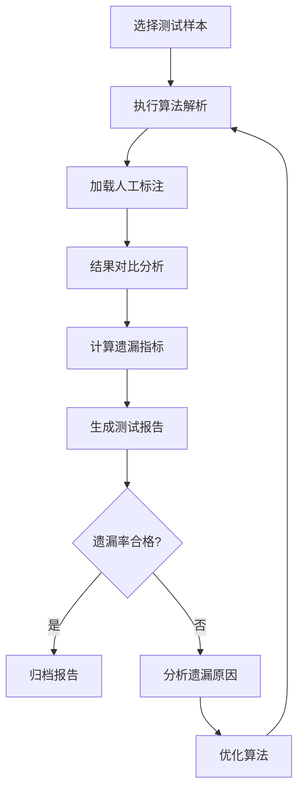

# 招标文件检查点解析算法测试方案

## 一、需求概述

### 1.1 需求背景
- 需要验证现有算法在解析招标文件时对检查点的识别准确性
- 重点关注检查点的**遗漏情况**（假阴性，False Negative）
- 评估算法在实际业务场景中的可靠性

### 1.2 核心目标
- 量化检查点解析的遗漏率
- 识别容易遗漏的检查点类型和场景
- 提供算法优化建议

---

## 二、技术方案设计

### 2.1 整体架构

```
┌─────────────────┐
│  招标文件样本库  │
└────────┬────────┘
         │
         ▼
┌─────────────────┐     ┌──────────────┐
│   待测试算法     │────▶│  解析结果    │
└────────┬────────┘     └──────┬───────┘
         │                      │
         ▼                      ▼
┌─────────────────┐     ┌──────────────┐
│  人工标注结果    │────▶│   对比分析   │
│  (Ground Truth) │     └──────┬───────┘
└─────────────────┘             │
                               ▼
                        ┌──────────────┐
                        │  测试报告    │
                        └──────────────┘
```

### 2.2 核心模块设计

#### 模块1：测试样本管理
```python
# 功能职责
- 收集和整理招标文件样本
- 建立样本分类体系（行业、文件类型、复杂度）
- 样本版本管理和更新
```

#### 模块2：标注数据管理
```python
# 功能职责
- 存储人工标注的检查点
- 支持多人协作标注
- 标注质量控制和一致性检查
- 标注数据版本控制
```

#### 模块3：算法测试引擎
```python
# 功能职责
- 调用待测试算法解析招标文件
- 收集算法输出结果
- 处理异常和错误情况
- 记录测试日志
```

#### 模块4：对比分析器
```python
# 功能职责
- 对比算法结果与人工标注
- 计算各项指标（精确率、召回率、F1值）
- 识别遗漏的检查点
- 分析遗漏模式
```

#### 模块5：报告生成器
```python
# 功能职责
- 生成可视化测试报告
- 汇总统计数据
- 提供改进建议
- 支持多种导出格式
```

---

## 三、测试指标体系

### 3.1 核心指标

| 指标 | 公式 | 说明 |
|------|------|------|
| **遗漏率 (Miss Rate)** | 遗漏检查点数 / 实际检查点总数 | 核心关注指标 |
| **召回率 (Recall)** | 正确识别数 / 实际检查点总数 | = 1 - 遗漏率 |
| **精确率 (Precision)** | 正确识别数 / 算法输出总数 | 评估误报情况 |
| **F1-Score** | 2 × P × R / (P + R) | 综合评估指标 |

### 3.2 细分维度

- **按检查点类型**：形式评审、资格评审、响应性评审、综合评审
- **按文件结构**：表格、段落、附件中的检查点
- **按表述方式**：明确要求、隐含要求、条件式要求
- **按位置分布**：章节位置、表格位置、脚注位置

---

## 四、数据准备方案

### 4.1 样本选择策略

```
样本分层
├── 覆盖度：至少涵盖 5 个不同行业
├── 数量：建议 50-100 份文件
├── 复杂度：简单/中等/复杂各占 1/3
└── 时效性：近 1 年的真实招标文件
```

### 4.2 标注规范概述

**说明**: 本章提供标注规范的简要概述，详细的标注方案设计请参见[第五章 标注方案详细设计](#五标注方案详细设计)。

#### 检查点定义

根据"投标文件检查项.xls"，检查点主要包括：

1. **资格要求类** - 注册资本、资质等级、认证证书、业绩要求、团队人员要求
2. **技术要求类** - 技术参数、性能指标、技术方案要求、实施标准
3. **商务要求类** - 报价要求、付款方式、交付期限、服务承诺
4. **评分标准类** - 明确的评分项和分值、扣分标准

**关键原则**：
- 标注招标文件中**实际存在**的检查点（不是表格里所有项）
- 一个完整的独立要求标注为一个检查点
- 包含明确的、隐含的、条件式的要求

#### 标注方式

**快速启动（MVP）**: 使用Excel表格标注
- 详见[第五章 5.3.1 Excel标注模板](#531-excel标注模板推荐mvp使用)

**长期方案**: 使用在线标注工具
- 详见[第五章 5.3.2 在线标注工具](#532-在线标注工具长期方案)

#### 质量控制要点

- **双人标注**: 两个标注员独立标注同一份文件
- **一致性检查**: 标注一致性 > 80% 为合格
- **完整性检查**: 确保所有关键位置的检查点均已标注

> 💡 **提示**: 完整的标注流程、分类体系、质量控制方法请参考[第五章 标注方案详细设计](#五标注方案详细设计)

---

## 五、标注方案详细设计

### 5.1 标注方案总体架构

```
┌─────────────────────────────────────────────────────────┐
│                   标注方案架构                          │
├─────────────────────────────────────────────────────────┤
│                                                         │
│  ┌──────────┐      ┌───────────┐      ┌──────────┐   │
│  │ 标注工具 │ ───▶ │ 标注规范  │ ───▶ │ 质量控制 │   │
│  └──────────┘      └───────────┘      └──────────┘   │
│       │                  │                   │        │
│       ▼                  ▼                   ▼        │
│  ┌──────────────────────────────────────────────────┐ │
│  │         Ground Truth 标注数据集                  │ │
│  └──────────────────────────────────────────────────┘ │
│                          │                            │
│                          ▼                            │
│              ┌───────────────────────┐               │
│              │   算法结果对比分析    │               │
│              └───────────────────────┘               │
└─────────────────────────────────────────────────────────┘
```

### 5.2 标注数据结构设计

#### 5.2.1 完整JSON数据结构

```json
{
  "annotation_id": "ANN-2026-001",
  "file_info": {
    "file_id": "b58c4fba-11a8-4810-9602-7e7cf17a1d63",
    "file_name": "XX项目竞争性磋商文件.pdf",
    "file_type": "pdf",
    "total_pages": 30
  },
  "annotator": {
    "name": "标注员A",
    "id": "ANNO-001"
  },
  "reviewer": {
    "name": "审核员B",
    "id": "REVIEW-001"
  },
  "annotation_date": "2026-01-30",
  "annotation_version": "v1.0",

  "checkpoints": [
    {
      "checkpoint_id": "CP-001",
      "category": "响应性评审",
      "subcategory": "符合性检查",
      "label": "磋商报价：总报价不超过项目预算金额或最高限价",

      "text": "总报价不超过项目(分包)预算金额或最高限价",
      "full_text": "磋商报价:总报价不超过项目(分包)预算金额或最高限价",

      "location": {
        "page": 29,
        "coord": "54.57,269.65,535.17,660.1",
        "section": "第三章 评审办法",
        "bounding_box": [54.57, 269.65, 535.17, 660.1]
      },

      "checkpoint_type": "pass_fail",
      "is_required": true,
      "weight": null,
      "max_score": null,

      "validation_rule": {
        "rule_type": "comparison",
        "operator": "<=",
        "reference": "预算金额或最高限价"
      },

      "keywords": ["报价", "预算", "限价", "不超过"],
      "context": {
        "before": "磋商报价:",
        "after": "磋商有效期:"
      },

      "parent_id": null,
      "level": 2,

      "annotation_notes": "实质性要求,不符合将废标",
      "confidence": 1.0,
      "is_difficult": false
    }
  ],

  "metadata": {
    "total_checkpoints": 18,
    "annotation_duration_minutes": 45,
    "difficulty_level": "medium",
    "special_cases": []
  }
}
```

#### 5.2.2 简化Excel标注结构

| 字段 | 说明 | 类型 | 必填 | 示例 |
|------|------|------|------|------|
| 文件ID | 文件唯一标识 | string | 是 | F001 |
| 检查点ID | 检查点唯一标识 | string | 是 | CP-001-001 |
| 检查点文本 | 检查点完整表述 | string | 是 | 投标人注册资本不低于1000万元 |
| 类别 | 一级分类 | string | 是 | 资格评审 |
| 子类别 | 二级分类 | string | 是 | 企业资质 |
| 页码 | 所在页码 | int | 是 | 3 |
| 是否必需 | 是否实质性要求 | bool | 是 | 是 |
| 检查点类型 | pass_fail/scoring | string | 是 | pass_fail |
| 权重/分值 | 评分项分值 | float | 否 | 20 |
| 关键词 | 提取关键词 | array | 否 | ["注册资本", "1000万"] |
| 位置坐标 | PDF坐标（可选） | string | 否 | 54.57,269.65,535.17,660.1 |
| 备注 | 标注说明 | string | 否 | 硬性要求 |

### 5.3 标注工具设计

#### 5.3.1 Excel标注模板（推荐MVP使用）

**工作表1: 检查点标注**

| 序号 | 文件ID | 检查点ID | 检查点文本 | 类别 | 子类别 | 页码 | 是否必需 | 检查点类型 | 权重/分值 | 关键词 | 位置坐标 | 备注 |
|------|--------|----------|------------|------|--------|------|----------|------------|-----------|---------|----------|------|
| 1 | F001 | CP-001-001 | 投标人注册资本不低于1000万元 | 资格评审 | 企业资质 | 3 | 是 | pass_fail | | 注册资本 | | 硬性要求 |
| 2 | F001 | CP-001-002 | 项目经理须具有一级建造师资格证书 | 资格评审 | 人员要求 | 3 | 是 | pass_fail | | 项目经理,建造师 | | |

**工作表2: 文件信息**

| 文件ID | 文件名 | 文件类型 | 总页数 | 行业类型 | 复杂度 | 标注员 | 审核员 | 标注日期 | 版本 |
|--------|--------|----------|--------|----------|--------|--------|--------|----------|------|
| F001 | XX项目招标.pdf | pdf | 45 | 工程类 | 中等 | 张三 | 李四 | 2026-01-30 | v1.0 |

**工作表3: 标注说明与规范**

包含：
- 检查点识别标准
- 分类体系说明
- ID命名规则
- 标注流程
- 质量检查清单

#### 5.3.2 在线标注工具（长期方案）

```python
"""
自定义标注工具核心功能设计
支持PDF在线浏览、文本选择、检查点标注、导出等功能
"""

class AnnotationTool:
    """招标文件检查点标注工具"""

    def __init__(self, pdf_path):
        self.pdf_path = pdf_path
        self.checkpoints = []
        self.current_page = 0
        self.file_info = {}

    def load_pdf(self):
        """加载PDF文件，支持翻页、缩放"""
        pass

    def select_text(self, page_num, text_range):
        """选择要标注的文本"""
        pass

    def add_checkpoint(self, text, category, is_required, notes=""):
        """添加检查点"""
        checkpoint = {
            "id": f"CP-{len(self.checkpoints)+1:03d}",
            "text": text,
            "category": category,
            "location": {
                "page": self.current_page,
                "coord": self.get_coordinates()
            },
            "is_required": is_required,
            "notes": notes
        }
        self.checkpoints.append(checkpoint)

    def edit_checkpoint(self, checkpoint_id, **kwargs):
        """编辑检查点"""
        pass

    def delete_checkpoint(self, checkpoint_id):
        """删除检查点"""
        pass

    def export_json(self):
        """导出JSON格式标注"""
        return {
            "file_info": self.get_file_info(),
            "checkpoints": self.checkpoints
        }

    def export_excel(self):
        """导出Excel格式"""
        pass
```

### 5.4 检查点识别与分类规范

#### 5.4.1 检查点识别标准

**什么是检查点？**

招标文件中对投标文件的实质性要求、评分标准、资格审查条件等需要投标人响应或评审专家检查的条款。

**检查点的5个核心特征：**

1. **强制性**: 使用"必须"、"应当"、"不得"等词汇
2. **可验证**: 能够通过投标文件材料进行核查
3. **有后果**: 不满足将导致废标、扣分或失分
4. **独立性**: 单独构成一个完整的要求项
5. **明确性**: 要求清晰，无歧义

**识别方法：**

```
关键词定位法
├── 强制性词汇: 必须、应当、不得、要求、符合...规定
├── 证明材料: 提供...证明、附...证书、提交...材料
├── 评分标准: 得X分、扣X分、最多X分
└── 条件判断: 满足...条件、符合...要求

章节定位法
├── 第二章 供应商须知 → 资格要求、响应要求
├── 第三章 评审办法 → 符合性检查、评分标准
├── 第四章 采购需求 → 技术参数、服务要求
└── 第六章 响应文件格式 → 格式要求、签章要求
```

#### 5.4.2 检查点分类体系

```
一级分类（4个）
│
├── 响应性评审
│   ├── 磋商报价
│   │   ├── 报价不存在缺项、漏项
│   │   └── 总报价不超过项目(分包)预算金额或最高限价
│   ├── 响应文件编制
│   │   ├── 按照...要求提供《磋商书》、《磋商报价明细表》
│   │   ├── 不存在两个或两个以上磋商方案
│   │   └── 未按磋商文件要求盖章或签字(签章)
│   ├── 响应要求
│   │   ├── 提供所投货物(或服务)确定的参数值或功能表述
│   │   ├── 工期(服务期限)、质保期符合...要求
│   │   └── 磋商有效期符合...要求
│   ├── 围标串标检查
│   │   ├── 不同供应商的响应文件由同一单位或者个人编制
│   │   ├── 不同供应商委托同一单位或者个人办理磋商事宜
│   │   └── 使用同一电脑或同一电子密钥
│   └── 其他实质性要求
│       ├── 强制采购的节能产品提供有效认证证书
│       ├── 满足预留份额给中小企业规定
│       └── 不存在采购人不能接受的附加条件
│
├── 形式评审
│   ├── 封面检查
│   │   ├── 是否按招标文件封面要求
│   │   └── 封面项目名称、项目编号、投标人名称、投标日期是否正确
│   ├── 签字盖章
│   │   └── 未按磋商文件要求盖章或签字(签章)
│   ├── 法定代表人及授权人
│   │   ├── 法定代表人信息检查
│   │   └── 授权人代表信息检查
│   └── 报价唯一性
│       └── 报价唯一性检查
│
├── 综合评审（评分项）
│   ├── 报价（10分）
│   ├── 类似业绩（20分）
│   ├── 项目组人员（10分）
│   ├── 总体服务方案（21分）
│   ├── 重点、难点分析及其对策措施（15分）
│   ├── 时间进度安排（8分）
│   ├── 质量保证措施（8分）
│   └── 对本项目合理化建议（8分）
│
└── 资格评审
    ├── 资格要求
    │   ├── 满足《政府采购法》第二十二条规定
    │   ├── 未被列入失信被执行人、重大税收违法失信主体
    │   ├── 落实政府采购政策需满足的资格要求
    │   └── 特定资格要求
    └── 资格审查
        ├── 提供孝昌县政府采购供应商资格信用承诺函
        ├── 单负责人为同一人或者存在直接控股、管理关系的不同供应商不得参加...
        └── 为本采购项目提供整体设计、规范编制或者项目管理、监理、检测等服务的...
```

### 5.5 标注操作规范

#### 5.5.1 标注操作步骤

```
步骤1: 文档浏览与理解（5-10分钟）
├── 通读全文，了解项目类型和规模
├── 重点关注章节
│   ├── 第二章 供应商须知
│   ├── 第三章 评审办法
│   ├── 第四章 采购需求
│   └── 第六章 响应文件格式
└── 标记重要章节位置

步骤2: 逐节标注检查点（20-40分钟）
├── 使用关键词定位
├── 判断是否为独立检查点
├── 记录检查点信息到标注表
└── 标记位置信息（页码+章节）

步骤3: 边界情况处理
├── 表格中的检查点: 每行独立标注
├── 列表中的检查点: 每条独立标注
├── 复合要求: 拆分为多个检查点
└── 引用条款: 同时标注原文和引用位置

步骤4: 质量检查（5分钟）
├── 检查标注完整性
├── 验证分类准确性
└── 确认位置信息
```

#### 5.5.2 标注示例

**示例1: 资格要求类检查点**

```
原文：
3.2 投标人注册资本不低于人民币1000万元。

标注：
{
  "checkpoint_id": "CP-001-001",
  "text": "投标人注册资本不低于人民币1000万元",
  "category": "资格评审",
  "subcategory": "资格要求",
  "checkpoint_type": "pass_fail",
  "is_required": true,
  "location": {"page": 3, "section": "3.2"},
  "keywords": ["注册资本", "1000万", "不低于"]
}
```

**示例2: 评分项检查点**

```
原文：
(2)类似业绩(20分):
供应商近三年以来承接过类似项目的,每完成1个类似业绩得4分,最多得20分。
未提供或提供不全的不得分。

标注：
{
  "checkpoint_id": "CP-001-002",
  "text": "供应商近三年以来承接过类似项目的,每完成1个类似业绩得4分,最多得20分",
  "category": "综合评审",
  "subcategory": "类似业绩",
  "checkpoint_type": "scoring",
  "is_required": false,
  "weight": 20,
  "max_score": 20,
  "location": {"page": 30, "section": "(2)"},
  "scoring_rule": {
    "unit": "每个业绩",
    "points": 4,
    "max_points": 20,
    "time_range": "近三年"
  }
}
```

**示例3: 复合要求（需拆分）**

```
原文：
项目经理须具有一级建造师资格证书，且具有5年以上相关项目管理经验。

标注为2个检查点：
[
  {
    "checkpoint_id": "CP-001-003A",
    "text": "项目经理须具有一级建造师资格证书",
    "category": "资格评审",
    "subcategory": "人员要求",
    "is_required": true
  },
  {
    "checkpoint_id": "CP-001-003B",
    "text": "项目经理具有5年以上相关项目管理经验",
    "category": "资格评审",
    "subcategory": "人员要求",
    "is_required": true
  }
]
```

### 5.6 标注质量控制

#### 5.6.1 双人标注与交叉验证

```
┌──────────────┐         ┌──────────────┐
│  标注员A     │         │  标注员B     │
│  独立标注    │         │  独立标注    │
└──────┬───────┘         └──────┬───────┘
       │                        │
       └────────┬───────────────┘
                ▼
       ┌────────────────┐
       │  一致性对比    │
       └────────┬───────┘
                │
       ┌────────▼────────┐
       │   差异讨论      │
       │   达成共识      │
       └────────┬────────┘
                ▼
       ┌────────────────┐
       │  最终标注结果  │
       └────────────────┘
```

**一致性指标：**

- **检查点级别一致性** = （两人都识别出的检查点数）/（任一人识别出的检查点总数）
- **合格标准**: > 80%
- **优秀标准**: > 90%

#### 5.6.2 质量检查清单

**完整性检查**
- [ ] 是否已通读全文所有章节？
- [ ] 表格、附件、脚注中的检查点是否已标注？
- [ ] "必须"、"应当"、"不得"等关键词处是否均已检查？
- [ ] 评分项是否已全部标注？

**准确性检查**
- [ ] 检查点分类是否正确？
- [ ] 检查点文本是否准确（无错漏字）？
- [ ] 页码位置是否正确？
- [ ] 是否必需判断是否准确？

**规范性检查**
- [ ] ID命名是否规范？
- [ ] 格式是否符合模板要求？
- [ ] 备注信息是否充分？

### 5.7 与算法结果的对比方案

#### 5.7.1 对比流程

```
┌──────────────────────┐      ┌──────────────────────┐
│   人工标注结果       │      │   算法解析结果       │
│  (Ground Truth)      │      │                      │
└──────────┬───────────┘      └──────────┬───────────┘
           │                              │
           └──────────┬───────────────────┘
                      ▼
           ┌──────────────────────┐
           │   检查点匹配算法     │
           │  (文本相似度匹配)    │
           └──────────┬───────────┘
                      ▼
           ┌──────────────────────┐
           │   对比分析           │
           │  - TP: 正确识别      │
           │  - FP: 误报          │
           │  - FN: 遗漏          │
           └──────────┬───────────┘
                      ▼
           ┌──────────────────────┐
           │   生成测试报告       │
           └──────────────────────┘
```

#### 5.7.2 检查点匹配算法实现

```python
from rapidfuzz import fuzz, process

def match_checkpoints(ground_truth, algorithm_result, threshold=0.85):
    """
    匹配人工标注与算法结果的检查点

    Args:
        ground_truth: 人工标注的检查点列表
        algorithm_result: 算法返回的检查点列表
        threshold: 文本相似度阈值 (0-1)

    Returns:
        dict: 包含 TP, FP, FN 和匹配详情
    """
    tp = []  # True Positive: 正确识别
    fp = []  # False Positive: 误报
    fn = []  # False Negative: 遗漏

    matched_algo = set()

    # 对每个人工标注的检查点，在算法结果中寻找最佳匹配
    for gt_checkpoint in ground_truth:
        gt_text = gt_checkpoint['text']
        gt_id = gt_checkpoint['checkpoint_id']

        # 使用模糊匹配寻找最相似的算法结果
        matches = process.extract(
            gt_text,
            [algo['value'] for algo in algorithm_result],
            scorer=fuzz.token_sort_ratio,
            limit=1
        )

        if matches and matches[0][1] >= threshold * 100:
            # 找到匹配
            best_match_idx = matches[0][2]
            matched_checkpoint = algorithm_result[best_match_idx]

            tp.append({
                'gt_id': gt_id,
                'algo_id': matched_checkpoint.get('id'),
                'gt_text': gt_text,
                'algo_text': matched_checkpoint['value'],
                'similarity': matches[0][1] / 100
            })
            matched_algo.add(best_match_idx)
        else:
            # 未找到匹配 = 遗漏
            fn.append({
                'gt_id': gt_id,
                'gt_text': gt_text,
                'gt_category': gt_checkpoint.get('category')
            })

    # 算法识别出但人工没有标注的 = 误报
    for i, algo_checkpoint in enumerate(algorithm_result):
        if i not in matched_algo:
            fp.append({
                'algo_id': algo_checkpoint.get('id'),
                'algo_text': algo_checkpoint['value'],
                'algo_label': algo_checkpoint['label']
            })

    return {
        'true_positives': tp,
        'false_positives': fp,
        'false_negatives': fn,
        'metrics': calculate_metrics(len(tp), len(fp), len(fn))
    }


def calculate_metrics(tp_count, fp_count, fn_count):
    """计算评估指标"""
    precision = tp_count / (tp_count + fp_count) if (tp_count + fp_count) > 0 else 0
    recall = tp_count / (tp_count + fn_count) if (tp_count + fn_count) > 0 else 0
    f1 = 2 * precision * recall / (precision + recall) if (precision + recall) > 0 else 0
    miss_rate = fn_count / (tp_count + fn_count) if (tp_count + fn_count) > 0 else 0

    return {
        'precision': precision,
        'recall': recall,
        'f1_score': f1,
        'miss_rate': miss_rate,
        'total_gt': tp_count + fn_count,
        'total_algo': tp_count + fp_count
    }


def generate_comparison_report(ground_truth, algorithm_result, output_path):
    """生成对比分析报告"""

    # 执行匹配
    match_result = match_checkpoints(ground_truth, algorithm_result)

    # 生成Markdown报告
    report = f"""# 招标文件检查点解析测试报告

## 一、测试概要
- 测试文件: {ground_truth[0].get('file_name', '未知')}
- 测试日期: {match_result['metrics']['test_date']}
- 人工标注检查点数: {match_result['metrics']['total_gt']}个
- 算法识别检查点数: {match_result['metrics']['total_algo']}个

## 二、核心指标
| 指标 | 数值 | 说明 |
|------|------|------|
| 遗漏率 (Miss Rate) | {match_result['metrics']['miss_rate']:.1%} | {len(match_result['false_negatives'])}个检查点未被识别 |
| 召回率 (Recall) | {match_result['metrics']['recall']:.1%} | 正确识别{len(match_result['true_positives'])}/{match_result['metrics']['total_gt']}个 |
| 精确率 (Precision) | {match_result['metrics']['precision']:.1%} | {len(match_result['false_positives'])}个误报 |
| F1-Score | {match_result['metrics']['f1_score']:.1%} | 综合评估 |

## 三、遗漏分析 (False Negatives)
"""

    # 添加遗漏详情
    for i, fn in enumerate(match_result['false_negatives'], 1):
        report += f"""
### FN-{i:03d}
- **检查点**: {fn['gt_text']}
- **类别**: {fn['gt_category']}
- **可能原因**: 待分析
- **建议**: 待补充
"""

    # 添加误报详情
    if match_result['false_positives']:
        report += "\n## 四、误报分析 (False Positives)\n"
        for i, fp in enumerate(match_result['false_positives'], 1):
            report += f"""
### FP-{i:03d}
- **检查点**: {fp['algo_text']}
- **算法标签**: {fp['algo_label']}
- **可能原因**: 算法误识别
"""
    else:
        report += "\n## 四、误报分析 (False Positives)\n无\n"

    # 保存报告
    with open(output_path, 'w', encoding='utf-8') as f:
        f.write(report)

    return match_result
```

#### 5.7.3 对比分析报告模板

```markdown
# 招标文件检查点解析测试报告

## 一、测试概要
- 测试文件: XX项目竞争性磋商文件.pdf
- 测试日期: 2026-01-30
- 人工标注检查点数: 18个
- 算法识别检查点数: 15个

## 二、核心指标
| 指标 | 数值 | 说明 |
|------|------|------|
| 遗漏率 (Miss Rate) | 16.7% | 3个检查点未被识别 |
| 召回率 (Recall) | 83.3% | 正确识别15/18个 |
| 精确率 (Precision) | 100% | 无误报 |
| F1-Score | 90.9% | 综合评估 |

## 三、遗漏分析 (False Negatives)

### FN-001
- **检查点**: "其他实质性要求:强制采购的节能产品按磋商文件要求提供有效认证证书"
- **类别**: 响应性评审 > 符合性检查
- **位置**: 第29页
- **可能原因**:
  - 文档中标注为"【可根据项目实际选择是否保留】"
  - 算法可能判断为非必需检查点而忽略
- **建议**: 优化条件式要求的识别逻辑

### FN-002
- **检查点**: "磋商有效期符合竞争性磋商文件要求"
- **类别**: 响应性评审 > 符合性检查
- **位置**: 第29页
- **可能原因**: 文本较短，关键词不突出
- **建议**: 增强短文本检查点识别能力

### FN-003
- **检查点**: "围标串标情形:不同供应商委托同一单位或者个人办理磋商事宜"
- **类别**: 响应性评审 > 符合性检查
- **位置**: 第29页
- **可能原因**: 围标串标相关检查点识别规则不完善
- **建议**: 补充围标串标检查点的识别模式

## 四、误报分析 (False Positives)
无

## 五、改进建议
1. **优化条件式检查点识别**: 对带【】标注的可选要求进行二次判断
2. **增强短文本识别**: 对5字以下的短文本检查点增加识别权重
3. **补充检查点模式库**: 整理常见检查点表述模板

## 六、附录
- 完整匹配详情
- 检查点列表对比
```

---

## 六、实现技术栈

### 5.1 推荐方案

```python
# 核心依赖
- Python 3.8+
- pandas: 数据处理和分析
- pytest: 测试框架
- matplotlib/plotly: 数据可视化
- openpyxl: Excel读写
- loguru: 日志管理
- requests: HTTP接口调用
- selenium/playwright: 浏览器自动化（如需模拟页面操作）

# 可选增强
- sklearn: 统计分析
- jinja2: 报告模板
- fastapi: 测试服务API
- sqlalchemy: 数据库管理
```

### 5.1.1 接口自动化技术方案

由于算法需要通过页面接口调用，以下是实现方案：

#### 方案A：直接HTTP请求（推荐）

```python
# 步骤1：使用浏览器开发者工具抓包
# 1. 打开Chrome DevTools (F12)
# 2. 切换到 Network 标签
# 3. 在页面中执行一次算法调用
# 4. 找到对应的请求，记录：
#    - 请求URL
#    - Request Headers (特别是 Cookie, Authorization)
#    - Request Body (JSON格式)

# 步骤2：编写批量调用脚本
import requests
import json
import time

class AlgorithmAPIClient:
    def __init__(self):
        self.base_url = "http://example.com/api"  # 从抓包获取
        self.session = requests.Session()
        # 设置从抓包获取的headers
        self.session.headers.update({
            "Content-Type": "application/json",
            "Cookie": "your_session_cookie",  # 从浏览器复制
            # 其他必要的headers...
        })

    def parse_document(self, file_path, doc_id):
        """调用算法解析接口"""
        # 读取文件（根据实际接口要求调整）
        files = {"file": open(file_path, "rb")}
        data = {"doc_id": doc_id}

        try:
            response = self.session.post(
                f"{self.base_url}/parse",
                files=files,
                data=data,
                timeout=60
            )
            response.raise_for_status()
            return response.json()
        except Exception as e:
            print(f"Error parsing {doc_id}: {e}")
            return None

# 使用示例
client = AlgorithmAPIClient()
result = client.parse_document("sample.pdf", "DOC-001")
print(result)
```

#### 方案B：浏览器自动化（如果接口有复杂加密）

```python
from selenium import webdriver
from selenium.webdriver.common.by import By
import time

class BrowserAutomation:
    def __init__(self):
        self.driver = webdriver.Chrome()
        self.login()  # 先登录

    def parse_document(self, file_path):
        """模拟页面操作调用算法"""
        # 1. 上传文件
        file_input = self.driver.find_element(By.ID, "file-upload")
        file_input.send_keys(file_path)

        # 2. 点击解析按钮
        parse_button = self.driver.find_element(By.ID, "parse-btn")
        parse_button.click()

        # 3. 等待结果
        time.sleep(10)  # 根据实际情况调整

        # 4. 提取结果
        result_element = self.driver.find_element(By.ID, "result")
        return json.loads(result_element.text)
```

**注意事项**：
- 优先使用方案A（直接HTTP请求），效率更高
- 如果接口有复杂的加密或签名，可能需要使用方案B
- 注意处理接口限流，添加适当的延迟
- 妥善保管认证信息（Cookie/Token），不要提交到代码仓库

```python
# 核心依赖
- Python 3.8+
- pandas: 数据处理和分析
- pytest: 测试框架
- matplotlib/plotly: 数据可视化
- openpyxl: Excel读写
- loguru: 日志管理

# 可选增强
- sklearn: 统计分析
- jinja2: 报告模板
- fastapi: 测试服务API
- sqlalchemy: 数据库管理
```

### 5.2 项目结构建议

```
ai_test/
├── data/
│   ├── samples/          # 招标文件样本
│   ├── annotations/      # 人工标注数据
│   └── results/          # 测试结果
├── src/
│   ├── core/            # 核心测试逻辑
│   ├── analyzers/       # 分析器模块
│   ├── reporters/       # 报告生成器
│   └── utils/           # 工具函数
├── tests/               # 单元测试
├── outputs/             # 输出报告
└── config/              # 配置文件
```

---

## 七、测试流程设计

### 6.1 标准测试流程



### 6.2 回归测试流程

```
算法修改后 → 全量样本测试 → 对比历史结果 → 趋势分析 → 发布决策
```

---

## 八、风险与挑战

### 7.1 主要风险

| 风险 | 影响 | 应对措施 |
|------|------|----------|
| 标注主观性 | 结果不一致 | 多人交叉验证，标注一致性检查 |
| 样本偏差 | 结论不通用 | 扩大样本覆盖面，分层采样 |
| 算法版本变化 | 结果不可比 | 建立基线版本，版本化管理 |
| 检查点边界模糊 | 标注困难 | 制定详细标注指南，典型示例库 |

### 7.2 技术挑战

- 如何自动判断两个检查点是否为同一检查点（文本相似度匹配）
- 处理检查点的层级关系（父子检查点）
- 表格结构化内容的准确识别
- 跨文档引用的检查点处理

---

## 九、实施计划

### 8.1 阶段划分

#### 阶段1：基础设施搭建（预计工作量：3-5天）
- [ ] 设计数据结构和存储方案
- [ ] 实现样本管理和标注加载模块
- [ ] 搭建测试框架

#### 阶段2：核心功能开发（预计工作量：5-8天）
- [ ] 开发算法测试引擎
- [ ] 实现结果对比分析器
- [ ] 构建指标计算模块

#### 阶段3：数据准备（预计工作量：5-10天，可并行）
- [ ] 收集招标文件样本
- [ ] 组织人工标注工作
- [ ] 标注质量审核

#### 阶段4：测试执行与分析（预计工作量：3-5天）
- [ ] 执行批量测试
- [ ] 生成分析报告
- [ ] 识别问题模式

#### 阶段5：优化迭代（预计工作量：持续）
- [ ] 根据测试结果优化算法
- [ ] 回归测试验证
- [ ] 建立持续监控机制

---

## 十、成功标准

### 9.1 定量目标
- 遗漏率降低到 **X%** 以下（根据业务要求设定）
- 测试覆盖 **至少 Y%** 的实际应用场景
- 测试执行时间控制在 **Z分钟/样本** 以内

### 9.2 定性目标
- 建立可重复的标准化测试流程
- 形成可持续的样本和标注库
- 输出明确的算法优化方向

---

## 十一、后续优化方向

1. **自动化标注辅助**：使用AI辅助人工标注，提高效率
2. **异常检测**：自动识别可能遗漏的高风险检查点
3. **增量测试**：支持新样本的快速验证
4. **A/B测试框架**：对比不同算法版本的效果
5. **实时监控**：生产环境中的检查点解析质量监控

---

## 十二、快速启动方案（MVP）

### 11.1 最小化测试流程

针对当前缺少标注数据的现状，提供快速启动方案：

```
第1步：准备 10 份典型招标文件
├── 工程、服务、货物类各 3-4 份
└── 简单、中等、复杂搭配

第2步：人工标注（最关键步骤）
├── 2人独立标注所有检查点
├── 使用统一标注格式
└── 交叉验证解决分歧

第3步：接口自动化
├── 浏览器抓包获取接口
├── 开发Python批量调用脚本
└── 测试接口连通性

第4步：执行对比测试
├── 运行算法解析所有样本
├── 与人工标注对比
└── 计算遗漏率和相关指标

第5步：生成报告
├── 汇总测试数据
├── 分析遗漏模式
└── 输出优化建议
```

### 11.2 核心交付物

1. **基准标注数据集**（10-15份文件的人工标注）
2. **接口自动化脚本**（批量调用算法的Python脚本）
3. **测试分析报告**（包含遗漏率、问题分析、优化建议）
4. **标注规范文档**（基于实践总结的标注指南）

### 11.3 MVP成功标准

- ✅ 完成 10 份文件的标注和验证
- ✅ 成功自动化调用算法接口
- ✅ 量化遗漏率（明确数字）
- ✅ 识别至少 3 个遗漏模式
- ✅ 提出可执行的优化建议

---

## 附录

### A. 关键问题确认

在开始实施前，需要确认以下问题：

1. ✅ 现有算法的接入方式是什么？（API、函数调用、独立服务？）
目前没有文档，只能通过页面执行，通过抓取接口，一个一个接口执行得到后台接口返回的算法结果

2. ✅ 已有多少标注数据？标注质量如何？
没有标注数据，只有一个产品给的表格，表格内容是算法需要解析出的检查点，但是不是每份招标文件都有这些要求

3. ✅ 目标遗漏率指标是多少？
没有这个指标

4. ✅ 测试周期要求？
待确认建议时长

5. ✅ 是否有现成的招标文件样本库？
招标文件有的，需要确认数量

### B. 现状分析与方案调整

#### B.1 核心挑战

基于以上确认信息，当前方案面临以下挑战：

1. **缺少Ground Truth基准数据**
   - 没有完整的人工标注数据作为对比基准
   - "投标文件检查项.xls"只是检查点类型清单，非具体文件的标注
   - 不同招标文件包含的检查点差异较大

2. **算法接入效率低**
   - 需要通过抓包获取接口
   - 逐个手动调用，无法批量自动化

#### B.2 调整后的测试策略

**阶段一：建立基准数据（必须先完成）**

由于缺少Ground Truth，需要先建立小规模标注样本：

```
样本标注流程：
├── 精选 10-20 份典型招标文件
├── 人工标注每份文件的所有检查点
├── 交叉验证标注质量（至少2人标注同一份文件）
└── 形成基准数据集（Benchmark Dataset）
```

**样本选择建议（数量：10-20份）**：
- 按行业分布：工程类 3-4份、服务类 3-4份、货物类 3-4份
- 按复杂度：简单 3份、中等 5份、复杂 5份
- 覆盖"投标文件检查项.xls"中的主要检查点类型

**标注工作量估算**：
- 1份文件人工标注：30-60分钟（取决于文件复杂度）
- 10份文件标注：5-10小时
- 交叉验证：增加 50% 时间
- **总计：8-15小时**（建议分2-3天完成）

**阶段二：自动化接口调用**

针对接口抓取问题，建议开发自动化脚本：

```python
# 接口自动化调用方案
1. 使用浏览器开发者工具抓包分析接口
2. 提取接口参数（请求头、请求体、认证信息）
3. 编写Python脚本批量调用接口
   - 使用 requests 库
   - 处理认证和会话保持
   - 添加重试和异常处理
4. 封装为批量测试工具
```

**阶段三：核心遗漏率测试**

在建立基准数据后，执行原方案的对比测试。

### C. 样本数量与周期建议

#### C.1 样本数量建议

| 阶段 | 样本数量 | 用途 | 时间投入 |
|------|----------|------|----------|
| **第一阶段（MVP）** | 10-15份 | 建立基准，验证方法 | 2-3天标注 + 1天测试 |
| **第二阶段（扩展）** | 30-50份 | 提升可信度 | 5-7天标注 + 2天测试 |
| **完整阶段** | 50-100份 | 全面评估 | 10-15天标注 + 3天测试 |

**建议起步方案**：先从 **10-15份样本** 开始，验证方法可行性后再扩展。

#### C.2 测试周期建议

**最小可行周期（MVP）：7-10个工作日**

```
Day 1-2: 样本选择与接口分析
  ├── 选定 10-15 份招标文件
  └── 抓包分析算法接口

Day 3-5: 人工标注（关键步骤）
  ├── 2人独立标注每份文件
  └── 交叉验证解决分歧

Day 6: 开发自动化调用脚本
  └── 实现批量接口调用

Day 7-8: 执行测试与数据分析
  ├── 运行算法解析
  ├── 对比结果计算指标
  └── 生成测试报告

Day 9-10: 问题分析与优化建议
  ├── 分析遗漏模式
  ├── 识别问题根源
  └── 输出优化建议
```

**完整测试周期：15-20个工作日**（如果扩展到50份样本）

### D. 参考资料

- [ ] 招标文件结构分析文档
- [ ] 检查点定义规范
  - ✅ 参考投标文件检查项.xls（检查点类型清单）
- [ ] 算法技术文档（暂无，需要抓包分析）
- [ ] 业务需求文档（待提供）

---

**文档版本**: v1.0
**创建日期**: 2026-01-30
**维护者**: [待填写]
**状态**: 待评审
