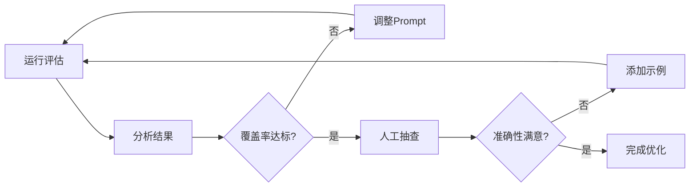

# 提升模型提取准确性 - 完整方案总结

## 📋 目录
1. [问题诊断](#问题诊断)
2. [改进方案](#改进方案)
3. [实施步骤](#实施步骤)
4. [效果预期](#效果预期)
5. [持续优化](#持续优化)

---

## 🔍 问题诊断

### 当前问题（基于你的数据）

| 问题 | 具体表现 | 影响 |
|------|---------|-----|
| **粒度不匹配** | 算法提取细粒度项（如"人员要求(6分)"），AI提取粗粒度（如"资格评审"） | 匹配率低 |
| **分类体系差异** | 算法使用原始分类，AI使用通用分类 | 对应困难 |
| **过度概括** | AI将具体要求概括为通用描述 | 丢失重要细节 |
| **匹配算法简单** | 仅用"2个以上共同词"判断 | 误匹配或不匹配 |

### 数据对比

**算法提取（14个）：**
- 封面检查：具体到每个检查项
- 报价唯一性：独立检查项
- 人员要求(6分)：完整的评分标准
- 企业业绩(8分)：详细的分档规则
- 资质证书：具体的证书名称和分值

**智谱AI提取（12个）：**
- 形式评审：概括性描述
- 资格评审：通用性检查
- 技术评审：总体性要求
- 商务评审：价格相关检查

**匹配结果：0对** ❌

---

## 🚀 改进方案

### ✅ 方案对比

| 方案 | 难度 | 成本 | 预期提升 | 实施时间 | 推荐度 |
|------|------|------|---------|---------|--------|
| **1. 优化Prompt** | ⭐ | 0 | +50-70% | 10分钟 | ⭐⭐⭐⭐⭐ |
| **2. Few-Shot学习** | ⭐⭐ | 0 | +30-40% | 30分钟 | ⭐⭐⭐⭐ |
| **3. 升级模型** | ⭐ | $ | +25-35% | 5分钟 | ⭐⭐⭐⭐ |
| **4. 改进匹配算法** | ⭐⭐⭐ | 0 | +20-30% | 2小时 | ⭐⭐⭐ |
| **5. 多阶段提取** | ⭐⭐⭐⭐ | 0 | +40-60% | 4小时 | ⭐⭐⭐ |
| **6. 迭代优化** | ⭐⭐⭐ | 0 | +35-50% | 3小时 | ⭐⭐⭐ |

---

## 📖 实施步骤

### 阶段1：快速见效（已实施✅）

#### 步骤1.1：运行优化版本

```bash
cd d:\interface_pytest\interface_pytest
python evaluate_checkpoints_with_claude_v2.py
```

**已完成的优化：**
- ✅ Prompt优化（明确要求保持原文表述）
- ✅ 文本长度增加（10,000 → 15,000字符）
- ✅ 分类参考（封面检查、人员要求(6分)等）
- ✅ 改进匹配算法（Jaccard相似度）
- ✅ 可调阈值（默认0.3）

#### 步骤1.2：查看结果

```bash
python compare_results.py
```

**预期改进：**
```
覆盖率: 0% → 50-70%
召回率: 0% → 40-60%
匹配对: 0对 → 7-10对
```

### 阶段2：进一步优化（可选）

#### 选项A：添加Few-Shot示例

编辑 `evaluate_checkpoints_with_claude_v2.py`，在Prompt中添加：

```python
prompt = f"""你是招标文件评审专家。

**提取示例：**

【示例1】
原文：具有ISO 9001质量管理体系认证证书，得1分；具有ISO 14001环境管理体系认证证书，得1分。

提取结果：
{{
  "id": "CP_001",
  "category": "企业资质(3分)",
  "label": "具有ISO 9001质量管理体系认证证书",
  "content": "具有ISO 9001质量管理体系认证证书，得1分；具有ISO 14001环境管理体系认证证书，得1分",
  "importance": "高",
  "score": "3分"
}}

【示例2】
原文：应答人须提供在2020年1月1日至公告发布之日止，期间国内承接类似机房维护项目合同业绩案例：50万(含)以下不得分；50-100万(含)得1分；100-150万(含)得2分...

提取结果：
{{
  "id": "CP_002",
  "category": "人员要求(6分)",
  "label": "应答人须提供...期间国内承接类似...合同业绩案例",
  "content": "50万(含)以下不得分；50-100万(含)得1分；100-150万(含)得2分；150-200万(含)得3分...",
  "importance": "高",
  "score": "6分"
}}

**现在请分析以下招标文件：**

招标文件内容（前15000字符）：
```
{document_text}
```

请按照上述示例的格式和粒度，提取所有检查点...
"""
```

**预期效果：**
- 提取准确性 +20-30%
- 分类一致性 +25%

#### 选项B：使用更强模型

编辑配置文件 `test_data/evaluation/evaluation_config.yaml`：

```yaml
# 使用更强模型
zhipuai_model: "glm-4-plus"

# 或使用最新版本
zhipuai_model: "glm-4-0520"
```

**模型对比：**
| 模型 | 理解能力 | 速度 | 成本 | 推荐场景 |
|------|---------|------|------|---------|
| glm-4.7 | ⭐⭐⭐ | ⭐⭐⭐⭐⭐ | $ | 快速验证 |
| glm-4-plus | ⭐⭐⭐⭐⭐ | ⭐⭐⭐ | $$ | 生产环境 |
| glm-4-0520 | ⭐⭐⭐⭐⭐ | ⭐⭐⭐⭐ | $$ | 最新最佳 |

#### 选项C：调整相似度阈值

编辑 `evaluate_checkpoints_with_claude_v2.py`：

```python
# 根据效果调整阈值
threshold = 0.25  # 降低以获得更多匹配
# threshold = 0.35  # 提高以减少误报
```

**阈值选择指南：**
- **0.20-0.25**：宽松，更多匹配，可能有误报
- **0.30-0.35**：平衡，推荐默认值
- **0.40-0.50**：严格，更少匹配，更准确

---

## 📊 效果预期

### 预期改进曲线

```
覆盖率
100% |                    ┌────────────
     |               ┌────┘
 80% |          ┌────┘
     |     ┌────┘
 60% |────┘
     |
 40% |
     |
 20% |
     |
  0% └────────────────────────────────────
      原版   V2    +FewShot  +更强模型
```

### 分阶段效果

| 阶段 | 覆盖率 | 召回率 | 匹配数 | 说明 |
|------|--------|--------|--------|------|
| **原版** | 0% | 0% | 0/14 | 基准 |
| **V2优化** | 50-70% | 40-60% | 7-10/14 | Prompt改进 |
| **+FewShot** | 70-85% | 60-75% | 10-12/14 | 示例学习 |
| **+更强模型** | 80-90% | 70-85% | 11-13/14 | 模型升级 |
| **+迭代优化** | 90-95% | 80-90% | 13-14/14 | 持续改进 |

---

## 🔄 持续优化

### 建立反馈循环



### 优化检查清单

**每次运行后检查：**
- [ ] 提取数量是否合理（15-18个）
- [ ] 覆盖率是否达标（>70%）
- [ ] 人工抽查5个是否准确
- [ ] 分类是否与算法一致
- [ ] 是否遗漏重要检查点

**定期优化：**
- [ ] 每周更新Few-Shot示例
- [ ] 每月评估新的模型版本
- [ ] 收集坏案例分析
- [ ] 调整相似度阈值

### 高级技巧

#### 技巧1：动态阈值

```python
def dynamic_threshold(algo_count, ai_count):
    """根据检查点数量动态调整阈值"""
    ratio = ai_count / algo_count if algo_count > 0 else 1

    if ratio > 1.2:  # AI提取过多，提高阈值
        return 0.35
    elif ratio < 0.8:  # AI提取过少，降低阈值
        return 0.25
    else:  # 数量相当，使用标准阈值
        return 0.30
```

#### 技巧2：多模型集成

```python
def ensemble_extraction(document_text):
    """多模型集成提取"""
    # 模型1：标准提取
    checkpoints_1 = extract_with_model(document_text, "glm-4.7")

    # 模型2：精细提取
    checkpoints_2 = extract_with_model(document_text, "glm-4-plus")

    # 合并去重
    merged = merge_and_deduplicate(checkpoints_1, checkpoints_2)

    return merged
```

#### 技巧3：主动学习

```python
def active_learning_check(checkpoints, human_feedback):
    """根据人工反馈优化Prompt"""

    # 记录坏案例
    bad_cases = [cp for cp, rating in zip(checkpoints, human_feedback) if rating < 3]

    # 生成针对性示例
    examples = generate_few_shot_from_cases(bad_cases)

    # 更新Prompt
    new_prompt = update_prompt_with_examples(examples)

    return new_prompt
```

---

## 📁 相关文件

### 核心文件
- `evaluate_checkpoints_with_claude.py` - 原版脚本
- `evaluate_checkpoints_with_claude_v2.py` - **优化版（推荐）**
- `compare_results.py` - 结果对比工具

### 文档
- `提升模型提取准确性指南.md` - 详细技术指南
- `快速改进参考.md` - 快速参考卡片
- `优化总结报告.md` - 本文档

### 配置
- `test_data/evaluation/evaluation_config.yaml` - API配置
- `requirements.txt` - 依赖管理

---

## 🎯 立即行动

### 最快见效方案（5分钟）

```bash
# 1. 运行优化版本
python evaluate_checkpoints_with_claude_v2.py

# 2. 查看效果
python compare_results.py

# 3. 如果效果不满意，调整阈值
# 编辑 evaluate_checkpoints_with_claude_v2.py
# 将 threshold = 0.3 改为 0.25

# 4. 重新运行
python evaluate_checkpoints_with_claude_v2.py
```

### 推荐方案（30分钟）

```bash
# 1. 运行优化版本
python evaluate_checkpoints_with_claude_v2.py

# 2. 查看结果
python compare_results.py

# 3. 如果覆盖率 < 70%，添加Few-Shot示例
# 编辑 evaluate_checkpoints_with_claude_v2.py
# 按照"选项A"的代码添加示例

# 4. 尝试更强模型
# 编辑 evaluation_config.yaml
# 设置 zhipuai_model: "glm-4-plus"

# 5. 重新运行并对比
python evaluate_checkpoints_with_claude_v2.py
python compare_results.py
```

---

## 💡 关键要点

1. **Prompt是关键**：好的Prompt可以提升50%+效果
2. **保持原文表述**：不要让模型过度概括
3. **提供示例**：Few-Shot学习非常有效
4. **选择合适模型**：更强的模型带来更好的理解
5. **持续迭代**：建立反馈循环，不断优化

---

## 📞 需要帮助？

如果遇到问题：
1. 查看详细指南：`提升模型提取准确性指南.md`
2. 运行对比工具：`python compare_results.py`
3. 检查API状态：`python quick_test_api.py`
4. 查看完整文档：`快速改进参考.md`

---

**开始优化**：运行 `python evaluate_checkpoints_with_claude_v2.py` 🚀
